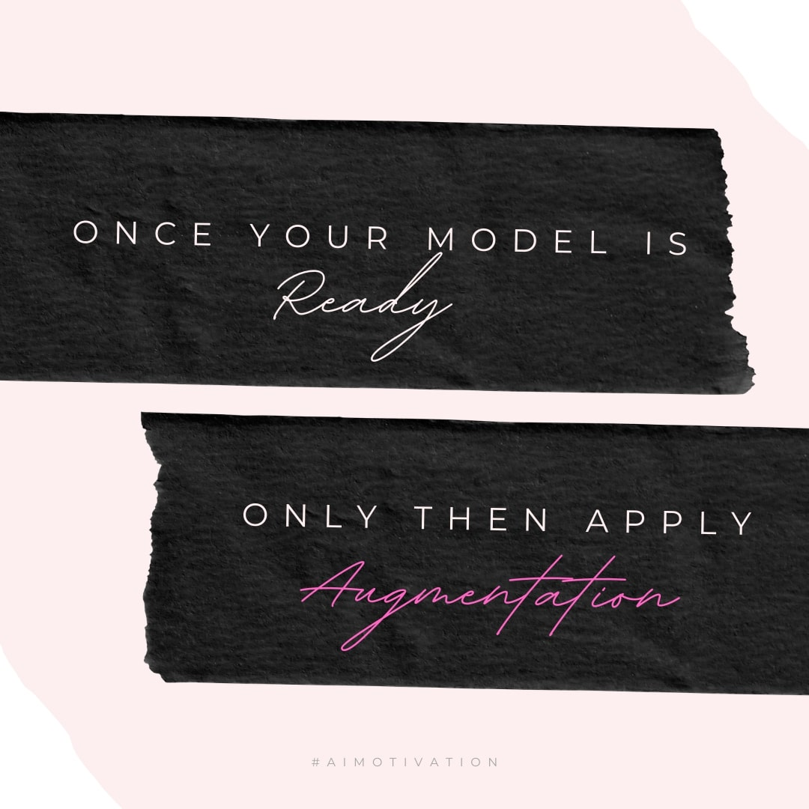

# CodeCodeCode

## Objective
In iterative fashion, step by step, using one concept at a time, acheive **99.4%** Validation Accuracy **consistently** on MNIST Dataset with in **15 epochs** and in under **10,000 paramaters**.

## Approach
So, the target of **99.4%** is acheived in 6 iterations

### 1. Bare Skeleton Model - To check whether model is training or not.  

### 2. Lighter Model - Reduce No. of Parameters to 8000.  

### 3. Add DropOut - Regularization to Avoid Over Fitting.  

### 4. Data Augmentation - Increasing Training Data to Better Train.  

### 5. LR Schedulers - To Stabalize Network.

### 6. Increasing Receptive Field - Why Stop at 28x28, Let's go Hihger.    

## Receptive Field

### Model 1:
|Layer No.|Operation|Input Feat.|Kernel Size|Padding|Stride|Output Feat.|Jump in|Jump Out|RF in|RF Out|
|:-------:|:-------:|:---------:|:---------:|:-----:|:----:|:----------:|:-----:|:------:|:---:|:----:|
|1|Conv2d|28|3|0|1|26|1|1|1|3|
|2|Conv2d|26|3|0|1|24|1|1|3|5|
|3|MaxPool|24|2|0|2|12|1|2|5|6|
|4|Conv2d|12|3|0|1|10|2|2|6|10|
|5|Conv2d|10|3|0|1|8|2|2|10|14|
|6|Conv2d|8|3|0|1|6|2|2|14|18|
|7|Conv2d|6|3|0|1|4|2|2|18|22|
|8|GAP|4|4|0|1|1|2|2|22|28|

### Model 2:
|Layer No.|Operation|Input Feat.|Kernel Size|Padding|Stride|Output Feat.|Jump in|Jump Out|RF in|RF Out|
|:-------:|:-------:|:---------:|:---------:|:-----:|:----:|:----------:|:-----:|:------:|:---:|:----:|
|1|Conv2d|28|3|1|1|28|1|1|1|3|
|2|Conv2d|28|3|1|1|28|1|1|3|5|
|3|MaxPool|28|2|0|2|14|1|2|5|6|
|4|Conv2d|14|3|0|1|12|2|2|6|10|
|5|Conv2d|12|3|0|1|10|2|2|10|14|
|6|Conv2d|10|3|0|1|8|2|2|14|18|
|7|Conv2d|8|3|0|1|6|2|2|18|22|
|8|Conv2d|6|3|0|1|4|2|2|22|26|
|9|GAP|4|4|0|1|1|2|2|26|32|
