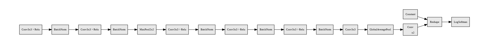
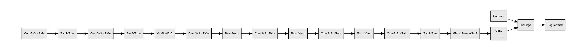

# Discover Network Architectures

## Objective

In iterative fashion, step by step, using one concept at a time, achieve **99.4%** Validation Accuracy **consistently** on MNIST Dataset with in **15 epochs** and in under **10,000 parameters**, even better if it's below **8,000 parameters**

## Approach

The target of **99.4%** is achieved in 6 iterations.

### Target

- *Parameters:* Less than 10,000
- *Data Augmentations:* If required
- *Regularization*: If required
- *LR Scheduler*: If required
- *Max No. of Epochs*: 14
- *Test Accuracy*: 99.4%

### 1. Bare Skeleton Model - To check whether model is training or not

To create a basic skeleton of the model, and check learning capabilities.

#### Results

- Total Parameters used: 9,902
- Best Train Accuracy: 99.14%
- Best Test Accuracy: 99.00%
- Consistency: Did not achieve any consistency with test accuracy greater than 99.4
- Base network architecture design

#### Analysis

With the base network architecture, we achieved a test accuracy of 99% which is not even close to the target test accuracy to achieve. We plan to improve the test accuracy by doing the following approaches:

Split the process into two different networks by varying the number of parameters.

1. Keep the same network architecture, but removing the fully connected layers.
2. Reduce the number of parameters in the model.

In each of these approaches, we performed the following changes in order to assist in achieving the target test accuracy.

- Add Dropout layers
- Perform Data Augmentation
- Use Learning Rate Schedulers

### Less than 10k parameters

|Target

|Results

|Analysis|
|----|----|----|
|Remove FC layer|Parameters: 9,060 Train Accuracy: 99.45% Test Accuracy:99.33%|We removed the fully connected layers from the base network architecture. This increased the test accuracy almost by 0.15%. Yet, we didn't reach the target test accuracy.  We will be adding dropout layers to the network hoping it improves the test accuracy.|
|Add Dropout Layer|Parameters: 9,060 Train Accuracy: 99.06% Test Accuracy:99.29%|Addition of Dropout layer with dropout value of 0.043, helps us improve our test accuracy. But we did not reach the target test accuracy.  We plan to achieve this by adding data augmentation to the network. We are hoping this increases the test accuracy and help us achieve the target accuracy.|
|Data Augmentation|Parameters: 9,060 Train Accuracy: 98.88% Test Accuracy:99.39%|Addition of Data augmentation (Random Rotation) increased the chances of reaching the target accuracy of 99.4%. We hit validation accuracy of 99.39 at the last two epochs. We feel we can achieve a better consistency along with crossing 99.4  We plan to achieve this by adding Learning Rate scheduler. The reasoning behind going towards LRScheduler is that, the accuracy keeps jumping between two ranges every 2 epochs. Based on our understanding, this happens when we are not able to reach the minima. Using LRScheduler gives us a better chances of reaching minima as the step size reduces.|
|Learning Rate Scheduler|Parameters: 9,060 Train Accuracy: 99.12% Test Accuracy:99.47%|The StepLR helped in stabilizing the learning, by reducing the learning rate to 10% after every 6th Epochs.  Why after every 6 epochs? We observed that the Loss was bouncing up and down, from 6th/7th epoch, so reducing the LR at that point would made the training stable.|

### Less than 8k parameters

|Target

|Results

|Analysis|
|:----:|----|----|
|Reducing number of parameters |Parameters: 7,826 Train Accuracy: 99.51% Test Accuracy:99.22%|We have got the Parameters Count, to where we wanted, below 8000. The model is still able to learn as we see that the training accuracy is going to 99.5 even with below 8000 parameters. Now we can use this Model with lesser parameters, and add Regularization using DropOut or do some Data Augmentation to improve Test Accuracy, as we again see that there is still Over fitting going on|
|Add Dropout Layer|Parameters: 7,826 Train Accuracy: 99.25% Test Accuracy:99.29%|We have used DropOut of 5%, which is like dropping 5 out of 100 weights after each layer. We can observe that, the over-fitting issue has been resolved, as clearly both the Test Loss and Accuracy of the Model are higher than the Training Loss and Accuracy, so which means there is still Learning opportunities and we can puish the training further and get better Test Accuracies. Also, when observing the Confusion Matrix and the Incorrect Identified Images above, we can see that the Model is confusing between 0 and 6 as there are quite high incorrect prediction of 6 as 0's. Same with 2 and 7. So, we can now bring some Data Augmentation techniques to Randomly Rotate images while Training, and with some estimation the Rotations look between ±15°.|
|Data Augmentation|Parameters: 7,826 Train Accuracy: 98.73% Test Accuracy:99.36%|We have used DropOut of 5%, after each layer and along with that now we are virtually increasing our dataset by adding agumentation, here we are using RandomRotation, which rotates iamges randomly between ±15°. We have even decreased the training accuracy, and increased test accuracy by using Augmentation, which is a good sign. But the Test Loss as we observe is not stable and is bouncing from 0.21 to 0.25 and not converging. So the Learning Rate of 0.01 may be too big at this point which is from epoch 6/7. So using some kind of Dynamic LR would be effecient.|
|Learning Rate Scheduler|Parameters: 7,826 Train Accuracy: 99.17% Test Accuracy:99.48%|The StepLR helped in stabilizing the learning, by reducing the learning rate to 10% after every 6th Epochs. Why after every 6 epochs? We observed that the Loss was bouncing up and down, from 6th/7th epoch, so reducing the LR at that point would made the training stable. And we can clearly see that the Accuracy/Loss in Testing is Bouncing heavily in the first 6 epochs, and after 6 epochs as we bring down the Learning Rate to 10% which is 0.001, the traning is stabilized and the loss as well as as Accuracy is pretty much stable and converging slowly from 99.39 at Epoch 7 to 99.48 by end of Training. So the use of LR, has brough stabilization to the training process, but selecting the correct epoch to reduce LR is challenging task and is human-controlled so need's fine-tuning and several trials before getting it right. We have acheived the Final target of consistently getting 99.4% Test Accuracy, for half the epochs, proving very good convergence of the model. But, we calculated the Receptive Field of the Model, and it's at 28, we wanted to see what happens when we increase the RF from 28 to 32, by adding one more Conv2f layer, but in effect keeping same number of total parameters.|

## Receptive Field

### Model 1

|Layer No.|Operation|Input Feat.|Kernel Size|Padding|Stride|Output Feat.|Jump in|Jump Out|RF in|RF Out|
|:-------:|:-------:|:---------:|:---------:|:-----:|:----:|:----------:|:-----:|:------:|:---:|:----:|
|1|Conv2d|28|3|0|1|26|1|1|1|3|
|2|Conv2d|26|3|0|1|24|1|1|3|5|
|3|MaxPool|24|2|0|2|12|1|2|5|6|
|4|Conv2d|12|3|0|1|10|2|2|6|10|
|5|Conv2d|10|3|0|1|8|2|2|10|14|
|6|Conv2d|8|3|0|1|6|2|2|14|18|
|7|Conv2d|6|3|0|1|4|2|2|18|22|
|8|GAP|4|4|0|1|1|2|2|22|28|

### Model 2

|Layer No.|Operation|Input Feat.|Kernel Size|Padding|Stride|Output Feat.|Jump in|Jump Out|RF in|RF Out|
|:-------:|:-------:|:---------:|:---------:|:-----:|:----:|:----------:|:-----:|:------:|:---:|:----:|
|1|Conv2d|28|3|**1**|1|28|1|1|1|3|
|2|Conv2d|28|3|**1**|1|28|1|1|3|5|
|3|MaxPool|28|2|0|2|14|1|2|5|6|
|4|Conv2d|14|3|0|1|12|2|2|6|10|
|5|Conv2d|12|3|0|1|10|2|2|10|14|
|6|Conv2d|10|3|0|1|8|2|2|14|18|
|7|Conv2d|8|3|0|1|6|2|2|18|22|
|8|Conv2d|6|3|0|1|4|2|2|22|26|
|9|GAP|4|4|0|1|1|2|2|26|32|

 
 

